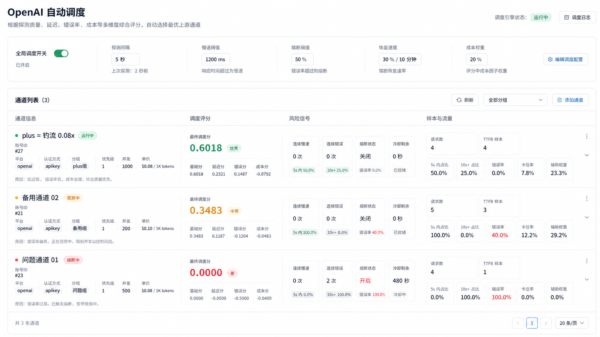

# OpenAI 自动调度设计

日期：2026-06-28

## 结论

本需求首期只覆盖 OpenAI 平台。自动调度不替换现有账号调度链路，而是在现有候选账号过滤之后增加一层评分选择：

1. 现有系统继续负责 API Key 分组、账号状态、模型支持、上游价格限制、并发槽、sticky session、rate limit、runtime block、failover。
2. 新增 OpenAI 自动调度评分服务，只在当前请求所属分组明确启用时参与排序和熔断跳过。
3. 自动调度异常、评分缺失或总开关关闭时，必须降级为现有系统调度。

## 范围

### 本期包含

- OpenAI 平台账号自动调度。
- 全局总开关。
- 分组级启用开关。
- 基于真实请求和定时探测的评分。
- 慢响应降权、错误重罚、熔断、半开恢复。
- `channel_price` 成本权重参与调度。
- 管理端 OpenAI 自动调度页，展示评分、风险信号、样本指标和配置。
- 基础调度事件日志，用于排查为什么某个渠道被降权或熔断。

### 本期不包含

- Anthropic、Gemini、Antigravity 自动调度。
- 对用户计费倍率和账单逻辑的改变。
- 复杂机器学习预测。
- 跨实例强一致的实时分数更新。允许以缓存为主，数据库为恢复和审计来源。

## 当前项目基础

当前 OpenAI 调度核心在 `backend/internal/service/openai_gateway_service.go`：

- `selectAccountForModelWithExclusions` 已有优先级和 LRU 选择。
- `selectAccountWithLoadAwareness` 已有 sticky session、并发负载、并发槽和 fallback wait。
- `listSchedulableAccounts` 已从 scheduler snapshot 或数据库取候选账号。
- `BlockAccountScheduling` 已提供 OpenAI 账号运行时临时熔断能力。

账号表 `backend/ent/schema/account.go` 已有：

- `priority`
- `concurrency`
- `load_factor`
- `schedulable`
- `rate_limited_at`
- `rate_limit_reset_at`
- `overload_until`
- `temp_unschedulable_until`
- `channel_price`

渠道监控模块已有：

- `ChannelMonitorRunner`
- `ChannelMonitorService.RunCheck`
- `ChannelMonitorHistory`
- `latency_ms`
- `ping_latency_ms`
- `status`

本设计会复用这些基础能力，但不会把自动调度逻辑塞进现有网关大方法中。

## 生效规则

自动调度是否生效必须满足全部条件：

```text
OpenAI 自动调度总开关 = true
AND 当前请求平台 = OpenAI
AND 当前 API Key 命中的 group_id 非空
AND 当前 group_id 已启用 OpenAI 自动调度
```

规则说明：

- 总开关关闭时，所有 OpenAI 请求都走现有系统调度。
- 总开关开启但当前分组未启用时，该分组仍走现有系统调度。
- 总开关开启且当前分组启用时，该分组内 OpenAI 候选账号按评分参与排序。
- 未分组 API Key 默认不启用自动调度，避免无归属请求被意外改变调度行为。
- 分组级开关是硬性条件，不允许仅因全局开启就影响所有分组。

## UI 设计

设计图：



### 页面入口

建议放在管理后台：

- 入口名称：OpenAI 自动调度
- 位置：调度相关设置附近，或账号管理/渠道监控相关菜单下

### 页面结构

顶部区域：

- 页面标题：OpenAI 自动调度
- 当前引擎状态：关闭、运行中、降级中
- 最近评分刷新时间
- 调度日志入口

配置区域：

- OpenAI 自动调度总开关
- 探测间隔
- 慢响应阈值
- 熔断阈值
- 恢复速度
- 成本权重
- 是否允许半开真实流量探测

分组控制区域：

- 分组选择器
- 当前分组是否启用自动调度
- 批量启用或停用分组
- 分组级说明：只有当前分组启用后，该分组的 OpenAI 请求才走自动调度

渠道评分列表：

- 每行一个 OpenAI 账号或上游渠道
- 左侧展示渠道身份：名称、账号 ID、平台、认证类型、分组、优先级、并发、上游价格、状态
- 中间展示最终调度分和分项：基础质量分、延迟分、错误分、成本分、恢复分
- 右侧展示风险信号：连续慢、连续错误、熔断状态、冷却到期
- 最右展示样本指标：请求数、TTFB 样本、5 秒内比例、10 秒以上比例、错误率、卡住率、辅助权重
- 每行保留原因说明，例如“连续慢响应较多，已降权观察”

### 分数展示

管理端展示使用 `0.0000` 到 `1.0000`。

后端内部建议用整数保存，例如 `0` 到 `10000`，避免浮点误差。返回给前端时格式化为四位小数。

## 评分模型

### 评分维度

评分状态按以下维度保存：

```text
account_id + group_id + model
```

退化规则：

- model 为空时使用 `account_id + group_id` 的默认评分。
- 某个模型无评分时，可回退到账号在该分组下的默认评分。
- 不同分组必须独立评分，同一个账号在不同分组中不能共享最终调度状态。

### 分项

最终调度分由以下分项组成：

```text
final_score = base_score
            + latency_score
            + error_score
            + recovery_score
            + cost_score
            - circuit_penalty
```

建议初始值：

- `base_score`：新账号默认 `0.6000`，避免新渠道无样本时直接抢占流量。
- `latency_score`：延迟越低越高，连续慢响应递减。
- `error_score`：错误率越低越高，连续错误重罚。
- `recovery_score`：探测成功或真实请求成功时逐步恢复。
- `cost_score`：基于 `channel_price` 计算，成本越高分值越低。
- `circuit_penalty`：熔断时直接压到不可调度区间。

### 慢响应

默认阈值：

- 慢响应：总耗时或 TTFB 超过 `10s`
- 严重慢响应：总耗时或 TTFB 超过 `20s`

建议规则：

- 单次慢响应：小幅扣分。
- 连续慢响应 2 次：明显降权，状态进入 observing。
- 连续慢响应 3 次：进入短期熔断或强降权。
- 成功且低延迟：清理或降低连续慢计数。

### 错误

错误分类：

- 网络错误、连接失败、超时：重罚。
- HTTP 5xx：重罚。
- 上游返回空响应、协议异常：中到重罚。
- HTTP 401、403：保留现有账号状态处理，评分记录事件，但不单独替代账号禁用逻辑。
- HTTP 429：优先沿用现有 rate limit cooldown，不简单等同渠道质量差。

建议规则：

- 单次严重错误扣 `0.3000` 到 `0.5000`。
- 连续错误 2 次进入熔断。
- 熔断期间热路径不选择该账号。

### 成本权重

成本分使用账号表已有 `channel_price`。

原则：

- `channel_price` 只影响调度，不影响账单。
- 成本权重默认不超过总分影响的 20% 到 30%。
- 成本权重为 0 时，不因价格改变排序。
- 价格缺失时按中性成本处理，不惩罚也不奖励。
- 成本不能压过质量底线，低价但高错误或严重慢的渠道仍应被降权或熔断。

### 熔断状态

状态定义：

- `running`：正常参与调度。
- `observing`：降权观察，仍可参与少量调度。
- `open`：熔断中，热路径跳过。
- `half_open`：半开恢复，只允许定时探测或少量真实探测。

触发建议：

- 连续错误达到阈值：进入 `open`。
- 连续慢响应达到阈值：进入 `observing` 或 `open`。
- 错误率超过阈值：进入 `open`。
- 冷却结束后进入 `half_open`。
- 连续成功达到恢复阈值后进入 `running`。

## 数据设计

### 评分状态表

建议新增：

```text
openai_auto_scheduler_score_states
```

字段：

- `id`
- `account_id`
- `group_id`
- `model`
- `final_score`
- `base_score`
- `latency_score`
- `error_score`
- `recovery_score`
- `cost_score`
- `state`
- `consecutive_slow_count`
- `consecutive_error_count`
- `consecutive_success_count`
- `request_count`
- `ttfb_sample_count`
- `slow_rate`
- `error_rate`
- `stuck_rate`
- `cooldown_until`
- `last_latency_ms`
- `last_ttfb_ms`
- `last_status_code`
- `last_error`
- `reason`
- `last_checked_at`
- `created_at`
- `updated_at`

索引：

- unique `(account_id, group_id, model)`
- `(group_id, final_score)`
- `(group_id, state)`
- `(cooldown_until)`

### 评分事件表

建议新增：

```text
openai_auto_scheduler_score_events
```

字段：

- `id`
- `account_id`
- `group_id`
- `model`
- `event_type`
- `score_before`
- `score_after`
- `latency_ms`
- `ttfb_ms`
- `status_code`
- `message`
- `created_at`

事件表用于排查，不进入热路径。

### 分组配置

建议在 `groups` 表增加字段：

```text
openai_auto_scheduler_enabled bool default false
```

理由：

- 分组开关是请求热路径判断条件，放在分组实体上最直接。
- 管理端分组列表也能直接展示和编辑。
- 默认 false，避免迁移后影响存量分组。

全局配置继续走 `settings` 表：

```text
openai_auto_scheduler_settings
```

保存 JSON 配置。

## 后端模块设计

### OpenAIAutoSchedulerSettings

职责：

- 解析全局设置。
- 提供默认值。
- 校验阈值范围。
- 缓存热路径需要的开关和权重。

建议默认值：

- `enabled=false`
- `probe_interval_seconds=60`
- `slow_threshold_ms=10000`
- `severe_slow_threshold_ms=20000`
- `consecutive_slow_breaker_threshold=3`
- `consecutive_error_breaker_threshold=2`
- `cooldown_seconds=120`
- `half_open_success_threshold=3`
- `cost_weight=0.2`
- `recovery_step=0.08`

### OpenAIAutoSchedulerScoreService

职责：

- 接收真实请求结果。
- 接收定时探测结果。
- 更新评分状态。
- 写入评分事件。
- 维护缓存。

输入事件：

- `success`
- `slow`
- `severe_slow`
- `error`
- `rate_limited`
- `probe_success`
- `probe_error`
- `manual_reset`

### OpenAIAutoSchedulerSelector

职责：

- 判断当前请求是否启用自动调度。
- 在现有候选账号内过滤 `open` 熔断账号。
- 对候选账号按评分、并发负载、原优先级、LRU 排序。
- 评分不可用时返回原候选顺序。

排序建议：

1. 熔断状态：`open` 跳过，`running` 优先于 `observing` 和 `half_open`。
2. 最终调度分：高分优先。
3. 现有负载率：低负载优先。
4. 现有优先级：数值小优先。
5. LRU：最久未使用优先。

### OpenAIAutoSchedulerProbeRunner

职责：

- 按全局探测间隔运行。
- 只检测启用自动调度的 OpenAI 分组。
- 对每个分组内可调度 OpenAI 账号执行轻量探测。
- 更新评分状态。
- 控制并发，避免探测压垮上游。

探测请求建议：

- 使用轻量模型请求。
- 支持默认模型和分组配置模型。
- 超时时间略高于慢响应阈值。
- 不记录敏感 API Key。

## 网关接入设计

### 选择账号前

在 OpenAI 请求热路径中：

1. 解析当前 API Key 的 `group_id`。
2. 判断全局总开关。
3. 判断当前分组的 `openai_auto_scheduler_enabled`。
4. 不满足条件时直接走现有调度。
5. 满足条件时，现有逻辑先筛出合法候选账号。
6. 自动调度选择器在候选账号内重新排序和跳过熔断账号。

### 请求结束后

请求完成后异步上报：

- `account_id`
- `group_id`
- `requested_model`
- `upstream_model`
- `latency_ms`
- `ttfb_ms`
- `status_code`
- `error_type`
- `stream_started`
- `completed`

真实请求结果用于快速发现慢响应和错误，定时探测用于恢复和补齐无流量渠道。

### failover

如果请求出现严重错误：

- 继续使用现有 failover 能力切换账号。
- 同时向评分服务记录错误事件。
- 达到阈值后评分服务进入熔断状态，后续热路径跳过。

## API 设计

管理端接口建议：

- `GET /api/admin/openai-auto-scheduler/settings`
- `PUT /api/admin/openai-auto-scheduler/settings`
- `GET /api/admin/openai-auto-scheduler/groups`
- `PUT /api/admin/openai-auto-scheduler/groups/:id`
- `GET /api/admin/openai-auto-scheduler/scores`
- `GET /api/admin/openai-auto-scheduler/events`
- `POST /api/admin/openai-auto-scheduler/scores/:id/reset`
- `POST /api/admin/openai-auto-scheduler/scores/:id/probe`

列表查询支持：

- group_id
- model
- state
- keyword
- min_score
- max_score
- page
- page_size

## 安全与风险

- 不打印 API Key、Token、完整凭证。
- 评分事件中的错误信息需要脱敏和截断。
- 定时探测必须限制并发。
- 配置默认关闭，迁移后不改变现有调度。
- 评分缓存异常时必须降级，不阻塞业务请求。
- 分组开关默认关闭，避免全局开启误伤全部分组。
- `channel_price` 不影响账单，只影响调度排序。

## 测试计划

后端单元测试：

- 总开关关闭时保持现有调度。
- 总开关开启但分组未启用时保持现有调度。
- 总开关开启且分组启用时按评分排序。
- `open` 熔断账号被跳过。
- `observing` 账号可参与但降权。
- 连续慢响应触发降权。
- 连续错误触发熔断。
- 定时探测成功逐步恢复。
- 成本权重只影响排序，不影响计费。
- 评分缓存不可用时降级原调度。

集成测试：

- OpenAI 请求真实流量回写评分。
- failover 后错误账号被扣分。
- 分组开关修改后热路径生效。
- 手动重置评分后状态恢复。

前端测试：

- 设置项加载、保存、校验。
- 分组级开关展示和保存。
- 评分列表按状态和分数渲染。
- 手动探测、重置评分按钮状态。

人工验证：

- 在测试环境准备 3 个 OpenAI 账号。
- 构造一个快账号、一个慢账号、一个错误账号。
- 开启全局开关但只开启测试分组。
- 确认测试分组走自动调度，其他分组仍走旧调度。
- 确认错误账号熔断后不再被选中。
- 确认定时探测成功后账号逐步恢复。

## 实施顺序

1. 数据结构和配置：新增分组开关、全局配置、评分状态表、事件表。
2. 评分核心：实现分数计算、熔断状态机、恢复规则。
3. 网关接入：在 OpenAI 候选账号选择阶段接入评分排序和熔断跳过。
4. 真实请求回写：请求完成后异步上报评分事件。
5. 定时探测：实现 OpenAI 自动调度探测 runner。
6. 管理端页面：按设计图实现配置、分组开关、评分列表和事件日志。
7. 验证和调参：补充测试，使用测试账号验证降权、熔断、恢复。

## 待实现确认

本设计已确认：

- 首期只做 OpenAI。
- UI 使用一行一个渠道的评分面板。
- 自动调度必须同时满足全局开关和分组开关。
- 未分组请求默认不启用自动调度。

进入实现前，需要基于本文档再生成详细 implementation plan。
