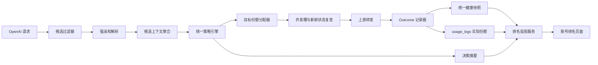

# OpenAI 统一调度策略与账号综合排名设计

日期：2026-07-15
状态：已接受，核心策略与账号排名第一阶段已落地
适用分支：`custom-main`

关联文档：

- [OpenAI 自动调度设计](./2026-06-28-openai-auto-scheduler-design.md)
- [OpenAI 统一调度与控制台优化设计](./2026-07-13-openai-unified-scheduler-design.md)
- [OpenAI 自动调度源码总结](../../OPENAI_SCHEDULER_SOURCE_SUMMARY.md)

本文继承上述文档的统一健康、真实 outcome、分组灰度和控制台方向，并补充统一评分、目标流量份额及账号排名设计。与旧文档的策略或开关语义冲突时，以本文为准；后续迭代继续遵循本文的统一策略与同源排名原则。

## 1. 结论

本设计在现有 OpenAI 高级调度、自动调度和 Balanced 调度实现之上继续收敛，目标不是再增加第四套规则，而是形成一个底层引擎、一个策略控制面和一个可验证的排名视图。

最终产品语义如下：

1. **高级调度引擎**是底层执行能力，负责候选过滤、粘性、策略调用、并发槽和失败回退。
2. **OpenAI 自动调度**是唯一面向管理员的日常策略控制面，负责全局开关、分组开关、策略模式、影子模式、健康和流量参数。
3. 现有 `openai_advanced_scheduler_enabled` 保留为兼容和紧急回滚开关，但从日常配置区移到“兼容与回滚”，不再让用户误以为它与自动调度是两个并列策略。
4. 自动调度只有在高级调度引擎可用、全局开关开启、分组开关开启且非影子模式时才影响真实流量。
5. 真实选号使用统一策略引擎计算，不再分别维护旧 Score Selector、Legacy 加权评分和 Balanced 字典序三套相互覆盖的结论。
6. 新增“账号排名”视图，分别展示综合排名、目标流量份额和实际流量份额，并解释两者偏离的原因。

本设计推荐的默认策略不是 winner-takes-all。性能或价格明显占优的账号应获得多数新会话流量，但必须受到并发容量、配额、熔断、最大份额和最小探索量保护。

## 2. 背景与现状问题

仓库已经完成统一健康快照、Balanced 调度和控制台的第一阶段实现，但当前真实行为仍有以下缺口。

### 2.1 开关语义不一致

当前存在：

- `openai_advanced_scheduler_enabled`
- 自动调度全局 `enabled`
- 分组 `openai_auto_scheduler_enabled`
- `mode`
- `shadow_mode`

旧 Selector 会检查全局和分组开关，而 Balanced 接入路径只读取 `mode/shadow/top_k`。管理员无法仅从页面判断某分组的有效策略。

### 2.2 三套排序规则重叠

当前同时存在：

1. 旧自动调度 Score Selector：按状态、速度、最终分、优先级和 LRU 排序。
2. 高级调度 Legacy Score：综合 priority、load、queue、error、TTFT、price、reset 和 quota，再从 Top-K 加权随机。
3. Balanced：按 TTFT、错误、队列、priority、价格等字典序排列，再按名次权重随机。

它们的数据口径、门控和权重不同，后执行的规则会覆盖先执行的顺序，导致设置值与真实流量无法直接对应。

### 2.3 成本设置与真实 Balanced 不一致

自动调度页面提供 `cost_weight`，但当前 Balanced 不消费该参数。价格位于 TTFT 和多项健康指标之后，只有前序值完全相同时才参与比较，因此不能表达“稍慢但便宜很多”或“稍贵但快很多”的权衡。

### 2.4 排名忽略性能差距

Balanced Top-K 使用固定名次权重。Top-3 无论候选之间差距多大，首选概率都接近 `50% / 33% / 17%`。这会让明显更优的账号无法获得与优势匹配的流量。

### 2.5 健康快照全量回退

任一候选健康快照缺失或过期时，整个候选池回退 Legacy。账号数量越多，触发整体回退的概率越高，且页面没有明确显示当前请求是否发生了回退。

### 2.6 控制台缺少真实分布闭环

现有健康表能展示 TTFT、错误率、价格和快照状态，但没有回答管理员最关心的三个问题：

- 当前谁排第一，为什么？
- 策略计划给每个账号多少新会话流量？
- 最近一小时实际给了多少流量，为什么和计划不一样？

## 3. 目标

1. 建立唯一、可测试、可复用的真实选号策略。
2. 明确高级调度引擎与自动调度策略的依赖关系和开关真值表。
3. 让速度、可靠性、成本、容量和配额进行可解释的综合权衡。
4. 让优势差距影响流量差距，同时避免单账号被瞬间打满。
5. 保持 `previous_response_id` 上下文一致，普通 session 在明显劣化时可逃逸。
6. 单个健康快照缺失只降级对应账号，不让整个分组回退。
7. 提供分组内账号综合排名、目标份额、实际份额和偏差解释。
8. 支持影子计算、按分组灰度和一键回滚。
9. 保持自动最低价分组、价格保护、overbrush、Compact、模型映射、SSE、WS、图片和现有计费语义不变。

## 4. 非目标

- 不使用机器学习模型预测渠道表现。
- 不改变用户计费、渠道结算或倍率语义。
- 不把不同模型族、endpoint 或 transport 混成一个不可解释的账号总分。
- 不强制迁移或删除现有 score state/event 历史表。
- 不在首版支持按用户或按 API Key 自定义调度策略。
- 不保证目标份额与所有请求实际份额完全相等，历史会话粘性和容量限制必然造成偏差。

## 5. 领域模型

### 5.1 调度分区

账号只能在相同调度分区内比较：

```text
group_id + model_family + endpoint + transport
```

其中：

- `group_id` 决定业务候选边界、组内 priority 和价格保护。
- `model_family` 使用最终上游模型的规范化名称。
- `endpoint` 使用最终上游 API 类型。
- `transport` 使用实际 HTTP/SSE 或 WebSocket 协议。

“全部模型”页面可以展示摘要，但不得给出跨分区的单一绝对排名。

### 5.2 候选状态

每个候选在一次决策中属于以下一种状态：

- `hard_rejected`：状态、能力、分组、价格保护、熔断等硬条件不满足。
- `eligible`：数据完整且可参与正常流量分配。
- `low_confidence`：可参与少量流量，但样本缺失、过少或过期。
- `latency_tail`：健康但超出当前策略延迟预算，只作为容量或失败回退。
- `recovery_only`：half-open，只允许恢复探针或严格受限流量。

### 5.3 份额口径

- **目标流量份额**只描述当前策略对新会话首选账号的概率。
- **实际流量份额**来自 `usage_logs` 中真实完成选号的账号分布。
- **粘性流量份额**单独统计强亲和和软亲和命中，避免将历史会话误判为策略不生效。
- **回退流量份额**统计首选账号并发满、复查失败或上游失败后的账号切换。

## 6. 开关与有效策略

### 6.1 目标开关模型

保留现有存储 key，但统一解释：

| 配置 | 目标语义 |
| --- | --- |
| `openai_advanced_scheduler_enabled` | 底层统一调度引擎兼容/回滚开关 |
| 自动调度 `enabled` | 全局是否允许统一策略参与计算和探测 |
| 分组 `openai_auto_scheduler_enabled` | 当前分组是否进入统一策略 |
| `mode` | `legacy`、`balanced`、`performance_first`、`cost_first`、`efficiency` |
| `shadow_mode` | 只记录新策略决策，不改变真实选号 |

### 6.2 真值表

| 高级引擎 | 全局自动调度 | 分组自动调度 | Shadow | 有效策略 |
| --- | --- | --- | --- | --- |
| 关 | 任意 | 任意 | 任意 | 上游兼容 Legacy |
| 开 | 关 | 任意 | 任意 | 高级 Legacy |
| 开 | 开 | 关 | 任意 | 高级 Legacy |
| 开 | 开 | 开 | 开 | 高级 Legacy 生效，统一策略影子计算 |
| 开 | 开 | 开 | 关 | 统一策略真实生效 |

未分组请求默认使用高级 Legacy，不允许因全局开关开启而进入自动调度。

### 6.3 控制面收敛

第一阶段保留两个页面入口，但自动调度页面顶部必须展示：

```text
有效策略：Balanced（真实生效）
依赖状态：高级调度引擎已开启 / 全局已开启 / 分组已开启 / Shadow 已关闭
```

第二阶段将“OpenAI 实验调度策略”从普通网关设置移到“兼容与回滚”，日常管理员只操作“OpenAI 自动调度”。关闭高级引擎时需要二次确认，明确所有自动调度分组将回退 Legacy。

## 7. 总体架构



### 7.1 候选过滤器

继续复用现有硬过滤：

- 账号与分组状态、可调度状态和临时暂停。
- 模型映射、Compact、图片和 endpoint 能力。
- transport 兼容。
- 账号过期、配额、限流和运行时阻断。
- 父子账号健康关系。
- 分组渠道价格保护。
- `excludedIDs` 和 failover 约束。

硬过滤结论不可被低价格、高速度或粘性覆盖。

### 7.2 候选上下文聚合器

一次批量加载并生成 `SchedulerCandidateContext`：

```text
account identity
group priority
health snapshot
sample confidence
predicted TTFT
error / 429 / 5xx rates
inflight / capacity / waiting
channel price
quota headroom
sticky relation
hard filter and fallback reasons
```

禁止策略引擎逐账号访问数据库或 Redis。

### 7.3 统一策略引擎

统一策略引擎是排名页面和真实请求共同调用的纯计算组件：

```go
Evaluate(input SchedulerPolicyInput) SchedulerPolicyDecision
```

输出至少包含：

- 有效策略和策略版本。
- 调度分区。
- 每个候选的资格状态。
- 分项得分、综合效用和排名。
- 目标流量份额。
- 强/软亲和处理结果。
- 回退顺序和可读原因码。

排名页面不得在 TypeScript 中复制该公式。

### 7.4 目标份额分配器

将综合效用转换为概率，并执行：

- Top-K 边界。
- 温度参数控制集中度。
- 最小探索流量。
- 单账号最大份额。
- 低置信度份额上限。
- 容量和配额约束。

### 7.5 排名投影服务

排名投影服务组合三类数据：

1. 策略引擎对当前状态的即时计算结果。
2. `usage_logs` 在所选窗口内的实际请求分布和性能。
3. 健康快照、当前负载、价格和样本置信度。

它返回运维视图，不参与真实请求热路径。

## 8. 统一评分模型

### 8.1 设计原则

- 综合效用用于流量分配，不再使用“前一字段不相等就完全忽略后一字段”的字典序。
- 熔断和价格保护仍是硬门槛，不进入软评分。
- 所有分项归一化到 `[0, 1]`。
- 每个策略模式只改变权重和边界，不改变字段定义。
- 分项、权重和最终原因必须可以在详情抽屉解释。

### 8.2 建议分项

```text
latency_score    = clamp(best_predicted_ttft / candidate_predicted_ttft, 0, 1)
reliability_score = 1 - clamp(error_rate
                              + 0.5 * rate_limited_rate
                              + 0.25 * server_error_rate, 0, 1)
cost_score       = normalized_cheapness(channel_price)
capacity_score   = 0.7 * (1 - load_rate) + 0.3 * (1 - normalized_waiting)
quota_score      = normalized_quota_headroom
priority_score   = normalized_group_priority
```

价格缺失时 `cost_score=0.5`，同时降低置信度；不得把未知价格当作最低价。

没有有效 TTFT 时 `latency_score=0.5`，标记 `low_confidence` 并限制最大份额，而不是让整个候选池回退。

### 8.3 综合效用

```text
utility = w_latency     * latency_score
        + w_reliability * reliability_score
        + w_cost        * cost_score
        + w_capacity    * capacity_score
        + w_quota       * quota_score
        + w_priority    * priority_score
        + sticky_bonus
```

`sticky_bonus` 只用于普通 session 软亲和，必须有上限，不能覆盖熔断、价格保护或明显劣化。

### 8.4 建议策略预设

| 模式 | 延迟 | 可靠性 | 成本 | 容量 | 配额 | 优先级 |
| --- | ---: | ---: | ---: | ---: | ---: | ---: |
| `balanced` | 0.35 | 0.25 | 0.15 | 0.15 | 0.05 | 0.05 |
| `performance_first` | 0.55 | 0.25 | 0.05 | 0.10 | 0.03 | 0.02 |
| `cost_first` | 0.20 | 0.25 | 0.40 | 0.08 | 0.04 | 0.03 |
| `efficiency` | 0.35 | 0.25 | 0.25 | 0.08 | 0.04 | 0.03 |

权重为首版建议默认值，必须通过影子数据校准后才能作为生产默认值。管理员优先选择策略预设；自定义权重放在高级设置中。

### 8.5 成本边界

即使选择 `cost_first`，候选仍需满足：

- 不处于熔断或恢复限制状态。
- 错误率不超过质量底线。
- 预测 TTFT 不超过成本模式的最大延迟预算。
- 不触发分组价格保护。

低价不能购买越过质量底线的资格。

## 9. 流量分配模型

### 9.1 Softmax 分配

对 Top-K 合格候选按综合效用分配：

```text
p_i = exp((utility_i - max_utility) / temperature)
      / sum(exp((utility_j - max_utility) / temperature))
```

- 温度越低，流量越集中到高分账号。
- 温度越高，流量越均衡。
- 优势差距会真实反映为份额差距。

建议默认：

| 模式 | Top-K | Temperature | 最大单账号份额 | 探索率 |
| --- | ---: | ---: | ---: | ---: |
| `balanced` | 3 | 0.18 | 70% | 3% |
| `performance_first` | 2 | 0.10 | 85% | 2% |
| `cost_first` | 3 | 0.16 | 75% | 3% |
| `efficiency` | 3 | 0.14 | 80% | 3% |

### 9.2 份额约束

按以下顺序修正原始概率：

1. 为合格探索候选预留最小探索份额。
2. 对低置信度候选应用默认 10% 的份额上限。
3. 对单账号应用策略最大份额。
4. 根据可用并发和配额对不可承载份额进行再分配。
5. 使用水位重分配保证最终总和为 100%。

当分区只有一个合格候选时允许 100%，页面必须显示“无可用冗余”。

### 9.3 实际选取

- 有稳定新会话键时使用稳定随机种子，保证同一新会话的初次选择可重复。
- 无会话锚点时加入请求级随机熵。
- 概率只决定首选账号；并发槽失败、DB 新鲜复查失败或 failover 时按策略回退顺序继续尝试。
- Top-K 之外账号保留在容量回退尾部，但不获得正常目标份额。

## 10. 粘性与逃逸

### 10.1 `previous_response_id`

保持强亲和。原账号满足硬条件时直接优先；不允许仅因另一个账号更便宜或更快而迁移。原账号不可用时沿用现有明确失败或可迁移能力约定。

### 10.2 `session_hash`

作为软亲和处理：

- 原账号位于可接受延迟预算内且无排队、429、5xx 或高错误率时，增加有限 `sticky_bonus`。
- 原账号相对最佳候选慢至少 1,000ms 且慢幅超过 25% 时允许逃逸。
- 排队、熔断、429、5xx 或价格保护失败时立即逃逸。
- 页面分别统计 session 命中和逃逸原因。

### 10.3 排名与粘性的关系

账号排名展示不因某个具体 session 改变基础综合排名。详情中另行展示：

- 无粘性目标份额。
- 带当前 session 软亲和后的决策变化。
- 实际流量中粘性请求占比。

## 11. 健康数据与降级

### 11.1 快照键

继续采用：

```text
account_id + model_family + endpoint + transport
```

同一物理账号跨分组共享健康事实，组内价格、priority 和开关在决策时关联。

### 11.2 样本优先级

- 近期真实请求优先于 probe。
- 真实样本新鲜期内，probe 不覆盖预测 TTFT。
- probe 用于冷账号、无流量账号和 half-open 恢复。
- 样本数、新鲜度和来源共同生成 `confidence`：`high`、`medium`、`low`。

### 11.3 局部降级

单个账号快照缺失或过期时：

- 不触发整个分区回退。
- 使用中性分项值。
- 标记 `low_confidence`。
- 限制目标份额。
- 触发异步补充 probe，但不阻塞请求。

只有健康存储整体不可用或策略计算失败时，才回退高级 Legacy，并记录明确的 `fallback_reason`。

## 12. 新页面：账号排名

### 12.1 页面位置

保留现有 OpenAI 自动调度路由和左侧分组列表，Tabs 调整为：

1. 概览
2. **账号排名**
3. 账号健康
4. 调度事件
5. 设置

账号排名是独立 Tab，不新增后台一级导航，避免与账号健康页面重复。

### 12.2 页面首屏

顶部固定显示有效策略状态：

```text
组 0.1 / gpt-5.4 / responses / HTTP SSE
有效策略：Balanced · 真实生效
候选 10 · 合格 7 · 熔断 2 · 低置信度 1
最近计算：6 秒前 · 策略版本 v2
```

如处于 Shadow、Legacy fallback、快照存储异常或分组未开启，必须使用显著状态条说明，不能只显示配置中的 `mode`。

### 12.3 筛选器

- 分组：必选，默认当前左侧分组。
- 时间窗口：`15m / 1h / 6h / 24h / 7d`，默认 `1h`。
- 模型族：必选或默认请求量最高的模型族。
- Endpoint：默认请求量最高的 endpoint。
- Transport：默认请求量最高的 transport。
- 状态：全部、合格、低置信度、延迟尾部、熔断、硬过滤。
- 流量类型：全部、新会话、粘性、回退。

当选择“全部模型/端点/协议”时，按调度分区分段展示，不生成跨分区总排名。

### 12.4 排名表

| 列 | 内容 |
| --- | --- |
| 排名 | 当前策略排名及较上一窗口变化 |
| 账号/渠道 | 账号名、账号 ID、渠道名、认证类型 |
| 资格 | eligible、low confidence、tail、circuit rejected |
| 综合效用 | 0-100 分及策略模式 |
| 目标份额 | 当前策略对新会话的首选概率 |
| 实际份额 | 统计窗口真实请求占比和请求数 |
| 份额偏差 | 实际减目标，并显示主要原因 |
| 性能 | 预测 TTFT、实际 P50/P90 |
| 稳定性 | 成功率、429、5xx |
| 容量 | inflight/capacity、waiting、负载率 |
| 成本 | 渠道价格、窗口估算账号成本 |
| 置信度 | 真实/probe 样本、快照年龄 |
| 决策摘要 | 如“速度第一，价格第三；受 70% 上限约束” |

默认按综合排名升序。表头支持按实际份额、P90、错误率和价格排序，但排序变化不改变“策略排名”列。

### 12.5 份额偏差解释

后端返回结构化原因：

- `sticky_existing_sessions`
- `previous_response_affinity`
- `capacity_saturated`
- `queue_fallback`
- `retry_failover`
- `health_low_confidence`
- `shadow_mode`
- `legacy_fallback`
- `insufficient_window_samples`

前端只做本地化映射，不自行推断原因。

### 12.6 账号详情抽屉

点击一行打开详情：

1. 综合效用分解条：延迟、可靠性、成本、容量、配额、priority、软亲和。
2. 目标份额计算：原始 Softmax、探索修正、最大份额修正、容量修正。
3. 实际份额趋势：目标与实际两条线。
4. TTFT P50/P90、错误率、429、5xx、排队趋势。
5. 最近结构化决策样本和失败回退。
6. 健康状态、样本来源、快照年龄和下一次 probe。
7. 手动 probe、重置健康状态；危险操作保留确认。

### 12.7 页面布局草图

```text
┌──────────────┬─────────────────────────────────────────────────────┐
│ 分组列表      │ 有效策略状态 / 分区筛选 / 时间窗口                 │
│              ├─────────────────────────────────────────────────────┤
│ 组 0.1  ON   │ # 账号/渠道  资格  综合分  目标  实际  TTFT  成本 │
│ 组 0.2  OFF  │ 1 Channel A  正常   91    64%   58%   820   0.7 │
│ 组 0.3  ON   │ 2 Channel B  正常   82    26%   31%  1050   0.4 │
│              │ 3 Channel C  低置信 70    10%   11%  1300   0.3 │
│              ├─────────────────────────────────────────────────────┤
│              │ 目标份额 vs 实际份额趋势 / 偏差原因                │
└──────────────┴─────────────────────────────────────────────────────┘
```

桌面端保持高密度表格；窄屏将分组列表移到上方，排名表允许横向滚动，核心的排名、账号、目标/实际份额固定在左侧。

## 13. API 设计

### 13.1 查询排名

```http
GET /api/v1/admin/openai-auto-scheduler/rankings
```

参数：

```text
group_id        required
window          15m|1h|6h|24h|7d
model_family    optional
endpoint        optional
transport       optional
eligibility     optional
traffic_type    all|new_session|sticky|fallback
sort            rank|actual_share|ttft_p90|error_rate|channel_price
order           asc|desc
page
page_size
```

响应示意：

```json
{
  "policy_context": {
    "engine_enabled": true,
    "global_enabled": true,
    "group_enabled": true,
    "configured_mode": "balanced",
    "effective_mode": "balanced",
    "shadow_mode": false,
    "fallback_reason": null,
    "policy_version": "v2",
    "calculated_at": "2026-07-15T15:30:00Z"
  },
  "partition": {
    "group_id": 10,
    "model_family": "gpt-5.4",
    "endpoint": "responses",
    "transport": "http_sse"
  },
  "summary": {
    "candidate_count": 10,
    "eligible_count": 7,
    "rejected_count": 2,
    "low_confidence_count": 1,
    "request_count": 12450
  },
  "items": [
    {
      "rank": 1,
      "account_id": 101,
      "account_name": "channel-a-01",
      "channel_id": 8,
      "channel_name": "Channel A",
      "eligibility": "eligible",
      "utility_score": 91.2,
      "target_share": 0.64,
      "actual_share": 0.58,
      "selected_requests": 7221,
      "predicted_ttft_ms": 820,
      "ttft_p50_ms": 910,
      "ttft_p90_ms": 1700,
      "success_rate": 0.993,
      "rate_limited_rate": 0.002,
      "server_error_rate": 0.001,
      "load_inflight": 4,
      "load_capacity": 10,
      "waiting_count": 0,
      "channel_price": 0.7,
      "confidence": "high",
      "deviation_reasons": ["sticky_existing_sessions"],
      "decision_summary": "latency_rank_1,max_share_capped"
    }
  ],
  "total": 10,
  "page": 1,
  "page_size": 20
}
```

### 13.2 查询账号排名详情

```http
GET /api/v1/admin/openai-auto-scheduler/rankings/:account_id
```

必须带同一组分区和窗口参数，返回分项得分、份额修正步骤、趋势和结构化原因。

### 13.3 策略模拟

第二阶段可增加：

```http
POST /api/v1/admin/openai-auto-scheduler/policy/simulate
```

只允许管理员提交临时模式和权重，返回目标份额变化，不保存设置、不影响真实流量。该接口不是首版阻塞项。

## 14. 数据来源与存储

### 14.1 首版复用

- 健康与预测：`openai_scheduler_health_states`。
- 实际请求、账号、分组、模型和耗时：`usage_logs`。
- 账号和渠道价格：账号/渠道关系及 `channel_price_snapshot`。
- 当前负载：`ConcurrencyService.GetAccountsLoadBatch`。
- 分组开关、priority 和价格保护：分组与账号关系快照。

### 14.2 决策摘要

真实请求需要生成结构化 `SchedulerDecisionSummary`，至少包含：

```text
policy_version
effective_mode
partition
selected_account_id
selected_rank
selected_target_probability
selection_layer
sticky_type
sticky_escape_reason
fallback_reason
candidate_count
eligible_count
```

首版可以将低基数摘要写入 usage log 增量字段，并对完整候选明细采用采样记录：

- 正常请求采样 1%。
- 所有 Shadow 新旧选择不一致请求记录。
- 所有回退、熔断、粘性逃逸和无候选请求记录。
- 完整候选明细设置保留周期，禁止无限增长。

### 14.3 聚合性能

排名接口不得每次扫描长周期原始日志：

- `15m/1h/6h` 可查询受索引约束的原始窗口或短期聚合。
- `24h/7d` 使用小时级聚合表或物化聚合。
- 聚合维度包括 group、account、model family、endpoint、transport 和 traffic type。
- 当前健康与负载在请求排名接口时实时拼接。

首版实现前先用真实数据量执行 `EXPLAIN ANALYZE`；若 1h 查询不能稳定在 300ms 内，则必须先增加小时聚合，不允许把慢查询直接接入轮询页面。

## 15. 配置设计

自动调度设置增量增加：

```json
{
  "mode": "balanced",
  "top_k": 3,
  "temperature": 0.18,
  "exploration_rate": 0.03,
  "max_account_share": 0.70,
  "low_confidence_max_share": 0.10,
  "latency_budget_ms": 1000,
  "session_escape_min_gap_ms": 1000,
  "session_escape_ratio": 0.25,
  "weights": {
    "latency": 0.35,
    "reliability": 0.25,
    "cost": 0.15,
    "capacity": 0.15,
    "quota": 0.05,
    "priority": 0.05
  }
}
```

兼容规则：

- 旧 `cost_weight` 映射到 `weights.cost`，保存新配置后停止双写。
- 旧 Advanced Scheduler 权重只供 Legacy fallback 使用。
- 未配置新字段时按模式默认值补齐。
- 配置保存时校验权重和接近 1，后端做最终规范化。
- UI 切换策略预设时展示将被修改的权重和份额边界。

## 16. 决策原因码

原因必须使用稳定枚举，日志和前端不得依赖自由文本：

### 16.1 资格原因

- `account_inactive`
- `account_unschedulable`
- `capability_mismatch`
- `transport_mismatch`
- `model_unsupported`
- `privacy_required`
- `price_guard_rejected`
- `runtime_blocked`
- `circuit_open`
- `half_open_recovery_only`
- `health_missing`
- `health_stale`
- `latency_budget_exceeded`

### 16.2 选择原因

- `previous_response_affinity`
- `session_affinity`
- `highest_utility`
- `weighted_allocation`
- `exploration_allocation`
- `capacity_fallback`
- `fresh_state_rejected`
- `retry_failover`
- `legacy_fallback`

## 17. 兼容与迁移

### 阶段 0：正确性修复

- Balanced 增加高级引擎、全局和分组门控。
- 页面显示配置模式与有效模式。
- `cost_weight` 未接入前明确标记为 Legacy-only，避免继续误导。
- 快照缺失和 Legacy fallback 增加指标。

### 阶段 1：统一纯计算策略和排名页面

- 实现统一 `Evaluate`，先用于 Shadow 和排名页面。
- 真实流量保持现状。
- 对比统一策略、Balanced 和 Legacy 的选择差异。
- 排名页面只读上线，验证目标/实际份额口径。

### 阶段 2：单分组灰度

- 对低风险分组启用统一策略真实流量。
- 默认 `balanced`，Top-K 3，最大份额 70%。
- 观察 TTFT、错误率、429、成本、粘性逃逸和份额偏差。

### 阶段 3：控制面收敛

- 自动调度成为唯一日常入口。
- 高级调度开关移入兼容与回滚。
- 旧 Selector 和 Balanced 排序改为适配统一策略或仅保留 Legacy fallback。
- 停止新增旧 score state 写入，历史数据保持只读。

### 阶段 4：策略预设与模拟

- 开放 performance、cost、efficiency 预设。
- 增加策略模拟和变更前影响预览。
- 基于真实流量校准默认温度和最大份额。

## 18. 回滚策略

- 分组级关闭：立即回到高级 Legacy，其他分组不受影响。
- 全局关闭：全部自动调度分组回到高级 Legacy。
- 高级引擎关闭：回到上游兼容 Legacy。
- 健康存储整体异常或策略计算 panic：请求内自动回退高级 Legacy，并记录告警。
- 回滚不删除健康、排名或决策数据；恢复后继续用于 Shadow 对比。

禁止通过回滚修改已执行迁移或清空历史状态。

## 19. 测试策略

### 19.1 门控测试

- 覆盖高级引擎、全局、分组、mode、shadow 的完整真值表。
- 未分组请求不进入自动调度。
- 分组关闭后已有健康快照也不能影响真实流量。

### 19.2 策略单元测试

- 各分项单调性：更快、更稳定、更便宜、更空闲不得降低对应分项。
- 成本权重为 0 时价格不改变效用。
- 相同健康下更低价格获得更高效用。
- 显著延迟差产生显著目标份额差。
- 最大份额、最小探索、低置信度上限和容量重分配总和始终为 1。
- 单候选、全熔断、全部低置信度、缺价格、缺 TTFT 和极端权重。
- 固定种子结果可重复，无会话请求分布符合目标概率。

### 19.3 粘性测试

- `previous_response_id` 不因成本或速度迁移。
- session 在健康范围内保持软亲和。
- TTFT、排队、429、5xx、熔断和价格保护触发逃逸。
- 粘性账号移出分组后绑定失效。

### 19.4 降级测试

- 单候选快照缺失只限制该候选，不回退整个分区。
- 健康存储整体异常回退 Legacy。
- Shadow 绝不改变真实选号。
- 排名 API 的有效模式和 fallback reason 与请求路径一致。

### 19.5 统计与 API 测试

- 目标份额来自同一策略引擎。
- 实际份额按分区和窗口正确聚合。
- 新会话、粘性和回退流量口径互斥且总数一致。
- 分页、排序、空状态、低样本和跨分区展示。
- 24h/7d 查询走聚合路径。

### 19.6 前端测试

- 有效策略状态条覆盖 live、shadow、legacy、fallback、disabled。
- 排名、目标份额、实际份额和偏差原因展示。
- 筛选变化取消过期请求。
- 详情抽屉分项与后端响应一致。
- 桌面和移动视口无重叠、溢出和不可操作控件。

## 20. 灰度验收指标

### 20.1 正确性

- 全局/分组门控违规选号为 0。
- `previous_response_id` 上下文错配为 0。
- 价格保护违规选号为 0。
- Shadow 改变真实选号为 0。
- 排名第一名、目标份额和真实策略计算不一致为 0。

### 20.2 性能与稳定性

- 选号阶段 P95 不超过 30ms。
- 策略纯计算 P95 不超过 1ms。
- 排名接口 1h 窗口 P95 不超过 300ms。
- P50 不高于对照组，P90 目标改善至少 20%。
- 429 或 5xx 相比对照上涨超过 0.2 个百分点时停止灰度。

### 20.3 分布与成本

- 排除粘性和容量受限请求后，新会话实际份额与目标份额在 10,000 次选择窗口内偏差不超过 5 个百分点。
- 单账号实际新会话份额不超过配置上限加 3 个百分点。
- `efficiency` 或 `cost_first` 模式下，质量底线不恶化时单位请求账号成本应低于 Balanced 对照。

## 21. 风险与缓解

| 风险 | 缓解 |
| --- | --- |
| 最优账号流量集中后触发 429 | 最大份额、容量约束、429 快速反馈和备用 Top-K |
| 低样本账号错误夺冠 | 置信度上限、探索流量、真实样本优先 |
| 粘性导致实际份额长期偏离 | 分开展示新会话/粘性份额和逃逸原因 |
| 排名查询拖慢数据库 | 短窗口索引、小时聚合、查询预算和缓存 |
| 配置过多难以使用 | 策略预设优先，自定义权重收进高级设置 |
| 上游合并冲突 | 新策略和投影放独立文件，高频网关文件只保留薄接口 |
| 新旧策略迁移行为突变 | Shadow 对比、分组灰度、明确有效模式和一键回滚 |

## 22. 实施边界建议

新增模块建议：

```text
backend/internal/service/openai_scheduler_policy.go
backend/internal/service/openai_scheduler_policy_types.go
backend/internal/service/openai_scheduler_allocation.go
backend/internal/service/openai_scheduler_ranking_service.go
backend/internal/repository/openai_scheduler_ranking_repo.go
frontend/src/components/admin/openai-scheduler/SchedulerRankingTable.vue
frontend/src/components/admin/openai-scheduler/SchedulerRankingDrawer.vue
```

现有高频文件只做薄接入：

- `openai_account_scheduler.go` 调用统一策略并执行结果。
- `openai_balanced_scheduler.go` 在迁移期适配统一策略，最终仅保留兼容层。
- `openai_auto_scheduler_selector.go` 在迁移期只服务 Legacy，最终停止作为独立真实排序器。
- `OpenAIAutoSchedulerView.vue` 继续作为路由容器。
- 前端组件不计算效用和概率。

本设计完成评审后，再按阶段生成 implementation plan。不得将门控修复、统一算法、排名页面和全量策略切换作为一次不可回滚的大提交。

## 23. 设计自检

- 已明确高级调度与自动调度不是二选一。
- 已定义唯一有效策略和完整开关真值表。
- 已让速度、可靠性、成本和容量进入同一可解释模型。
- 已区分目标份额、实际份额、粘性份额和回退份额。
- 已避免跨模型、endpoint、transport 的伪综合排名。
- 已设计局部健康降级，消除单快照导致全池回退。
- 已提供页面、API、数据来源、迁移、回滚、测试和验收标准。
- 未改变计费、价格保护、上下文强亲和和现有二开功能边界。
